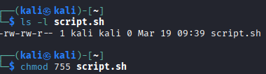

## 📅 오늘 학습한 내용
지난 포스팅에서 리눅스의 기초 명령어를 다뤘다면, 오늘은 리눅스 보안의 뼈대라고 할 수 있는 **파일 권한(Permission)**과 **소유권(Ownership)** 시스템을 심층 학습했습니다. 다중 사용자 환경에서 내 데이터를 보호하는 법을 이해하는 시간이었습니다.

---

## 1. 리눅스 권한 구조 분석 (`ls -l`)
터미널에서 `ls -l`을 입력했을 때 나타나는 `-rwxr-xr-x` 같은 외계어(?)를 해독하는 방법입니다.

* **구분자 (1자)**: `-`는 일반 파일, `d`는 디렉토리를 의미합니다.
* **사용자 그룹 (9자)**: 3글자씩 끊어서 **소유자(User) / 그룹(Group) / 나머지(Others)**의 권한을 나타냅니다.
    * `r (Read)`: 읽기 권한 (4)
    * `w (Write)`: 쓰기/수정 권한 (2)
    * `x (Execute)`: 실행 권한 (1)

---

## 2. 권한 변경의 마법: `chmod`
파일의 권한을 변경할 때는 숫자의 합을 이용한 **8진수 모드**가 가장 효율적입니다.

| 권한 합계 | 기호 | 의미 |
| :--- | :--- | :--- |
| **7** | `rwx` | 읽기, 쓰기, 실행 모두 가능 |
| **6** | `rw-` | 읽기, 쓰기 가능 |
| **5** | `r-x` | 읽기, 실행 가능 (주로 디렉토리에 부여) |
| **4** | `r--` | 읽기만 가능 |

> **실습 예시**
> `chmod 755 script.sh` → 소유자는 모든 권한, 나머지는 읽고 실행만 가능하게 설정

 처음 생성후 권한 확인 후 chmod로 추가 권한 부여
 

이후 추가 권한을 준 뒤 확인한 권한

 .png)

---
## 3. 소유권 변경: `chown` & `chgrp`
파일의 주인(Owner)을 바꾸는 작업은 시스템 관리자(`sudo`)만 가능하며, 보안 설정 시 필수적인 단계입니다.

* **소유자 변경**: `sudo chown [사용자명] [파일명]`
* **소유자와 그룹 동시 변경**: `sudo chown [사용자]:[그룹] [파일명]`
* **보안 포인트**: 웹 서버 소유자를 일반 사용자가 아닌 `www-data` 등으로 격리하여, 웹 서비스가 뚫리더라도 시스템 전체 권한을 탈취당하지 않도록 방어합니다.

---

## 💡 느낀 점 & 보안 포인트
* **권한의 무서움**: 모든 권한을 주는 `777` 설정이 얼마나 위험한지 깨달았습니다. 누구나 내 파일을 수정하거나 악성코드를 심을 수 있는 통로가 됩니다.
* **실행 권한(`x`)의 의미**: 쉘 스크립트나 바이너리 파일은 실행 권한이 없으면 단순한 텍스트 덩어리에 불과하다는 점이 흥미로웠습니다.
* **디렉토리 권한**: 디렉토리에 `x` 권한이 없으면 그 안으로 `cd`(이동)조차 할 수 없다는 사실을 실습을 통해 확인했습니다.

---

## 🚀 앞으로의 계획
* **UMASK 이해하기**: 파일이 생성될 때 기본 권한이 어떻게 결정되는지 `umask` 설정 값을 분석해 보겠습니다.
* **특수 권한 실습**: `SetUID`, `SetGID`, `Sticky Bit`처럼 리눅스 보안의 고급 주제이자 취약점이 될 수 있는 특수 권한들을 공부해 볼 예정입니다.
* **관리자 권한 분리**: 모든 작업을 `root`로 수행하지 않고, 일반 계정에서 필요한 권한만 할당하는 `sudoers` 설정법을 익히겠습니다.